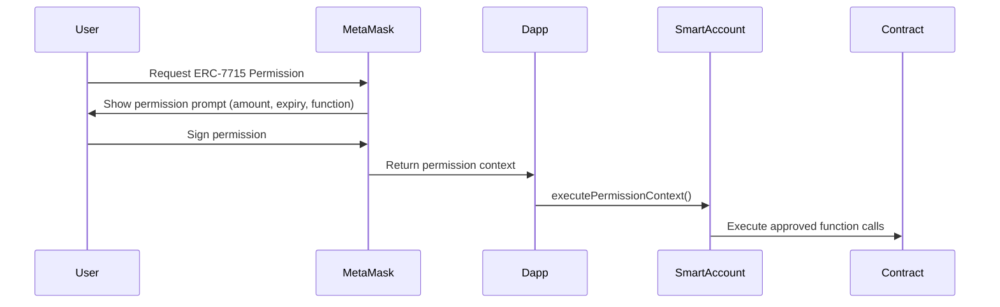
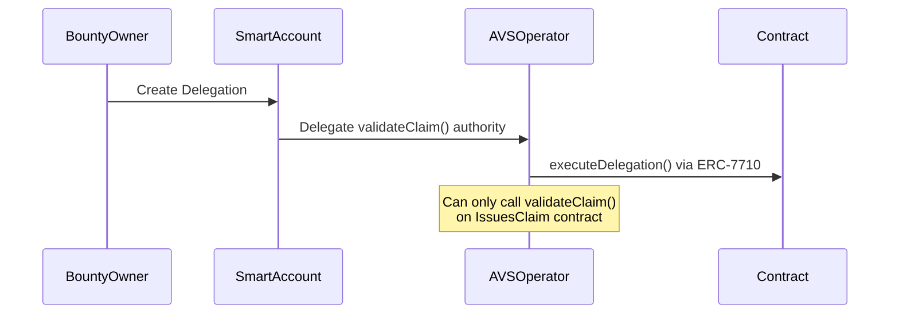

<div align="center">
  

  # zkPull — Decentralized GitHub Bounty Platform

  **MetaMask Hackathon 2025 | Built with MetaMask Smart Accounts + EigenLayer AVS + Venice AI**

  [](https://explorer.sepolia.mantle.xyz)
  [](https://metamask.io)
  [](LICENSE)

</div>

---

## Table of Contents

- [What is zkPull?](#what-is-zkpull)
- [Problem & Solution](#problem--solution)
- [Architecture Overview](#architecture-overview)
- [MetaMask Integration](#-metamask-integration)
  - [Smart Accounts (ERC-7702)](#1-smart-accounts-erc-7702)
  - [Advanced Permissions (ERC-7715)](#2-advanced-permissions-erc-7715)
  - [Delegations (ERC-7710)](#3-delegations-erc-7710)
- [1Shot API Integration](#️-1shot-api-integration)
- [Venice AI Integration](#-venice-ai-integration)
- [zkTLS + AVS Validation](#-zktls--avs-validation)
- [Smart Contracts](#-smart-contracts)
- [Deployed Contracts & Explorer Links](#-deployed-contracts--explorer-links)
- [Project Structure](#-project-structure)
- [Complete User Flow](#-complete-user-flow)
- [Setup Guide](#-setup-guide)
- [Tech Stack](#-tech-stack)
- [Testing Guide](#-testing-guide)

---

## What is zkPull?

zkPull is a **decentralized GitHub bounty platform** that lets repository owners create bounties (in mUSD tokens) for GitHub issues and allows developers to automatically claim rewards when their pull requests are merged — all verified trustlessly using:

- **zkTLS proofs** — cryptographic proof that a PR was merged, without exposing secrets
- **EigenLayer AVS** — decentralized validator network that auto-validates claims
- **MetaMask Smart Accounts** — gasless transactions via ERC-4337 UserOperations
- **1Shot API** — server-side wallet for batch payouts and automated execution
- **Venice AI** — AI-powered PR analysis, bounty descriptions, preview images, and chat assistant

Deployed on **Mantle Sepolia** (L2 on Ethereum).

---

## Problem & Solution

### Problem

| Challenge | Description |
|-----------|-------------|
| Payment Delays | Contributors wait weeks for manual payout |
| Trust Issues | No guarantee bounty will be paid after work |
| Manual Verification | Owners manually verify PR merge status |
| Gas Costs | Each on-chain action costs ETH/OG gas |
| No Automation | No way to auto-distribute rewards |
| No AI Insight | No analysis of PR quality or fraud detection |

### Solution

| zkPull Feature | How It Solves It |
|----------------|------------------|
| **Smart Account UserOps** | Gasless bounty creation and claiming via ERC-4337 bundler |
| **ERC-7715 Permissions** | Grant dapp one-time or periodic spending limits — no escrow lock needed |
| **ERC-7710 Delegations** | Smart account delegates validation authority to AVS operators |
| **zkTLS + AVS** | Automated, trustless PR merge verification within 30-60 seconds |
| **1Shot API** | Batch reward payouts, server wallet for platform fees |
| **Venice AI** | PR quality scoring, auto-generated descriptions, spam detection, chat assistant |

---

## Architecture Overview

```
                              ┌─────────────────────────────────────┐
                              │         User's Browser              │
                              │  Next.js 15 + RainbowKit + Wagmi   │
                              │                                     │
                              │  ┌─────────────────────────────┐   │
                              │  │  MetaMask Wallet (EOA)      │   │
                              │  └──────────┬──────────────────┘   │
                              │             │                      │
                              │  ┌──────────▼──────────────────┐   │
                              │  │ Smart Account (ERC-7702     │   │
                              │  │ Hybrid — EOA + SC)         │   │
                              │  └──────────┬──────────────────┘   │
                              │             │                      │
                              │  ┌──────────▼──────────────────┐   │
                              │  │ UserOperations via Bundler  │   │
                              │  │ (Gasless with Paymaster)    │   │
                              │  └─────────────────────────────┘   │
                              └──────────┬──────────────────────────┘
                                         │
                ┌────────────────────────┼────────────────────────┐
                │                        │                        │
                ▼                        ▼                        ▼
     ┌──────────────────┐    ┌──────────────────┐    ┌──────────────────┐
     │   ERC-7715       │    │   ERC-7710       │    │   Venice AI      │
     │   Permissions    │    │   Delegations    │    │   (Frontend)     │
     │   (User → Dapp)  │    │   (SC → AVS)     │    │   Chat/Image     │
     └────────┬─────────┘    └────────┬─────────┘    └────────┬─────────┘
              │                       │                       │
              └───────────────────────┼───────────────────────┘
                                      │
                         ┌────────────▼────────────┐
                         │     Express Backend      │
                         │    (localhost:5000)       │
                         │                          │
                         │  ┌────────────────────┐  │
                         │  │  zkTLS Proof Gen   │  │
                         │  │  (Reclaim Protocol)│  │
                         │  ├────────────────────┤  │
                         │  │  1Shot API Client  │  │
                         │  ├────────────────────┤  │
                         │  │  Venice AI Service │  │
                         │  ├────────────────────┤  │
                         │  │  GitHub OAuth      │  │
                         │  └────────────────────┘  │
                         └────────────┬─────────────┘
                                      │
                         ┌────────────▼─────────────┐
                         │     Mantle Sepolia        │
                         │     (Chain ID: 5003)      │
                         │                           │
                         │  ┌─────────────────────┐  │
                         │  │ MantleUSD (mUSD)     │  │
                         │  │ ERC-20 Token        │  │
                         │  ├─────────────────────┤  │
                         │  │ IssuesClaimWithAVS  │  │
                         │  │ Main Bounty Contract│  │
                         │  ├─────────────────────┤  │
                         │  │ ZKPullAVS           │  │
                         │  │ Operator Registry   │  │
                         │  └─────────────────────┘  │
                         └────────────────────────────┘
                                      │
                         ┌────────────▼─────────────┐
                         │   AVS Operator Bot       │
                         │   (zkpull-AVS-main)       │
                         │                           │
                         │  Listens for tasks →      │
                         │  Verifies via zkTLS →     │
                         │  Submits validation →     │
                         │  Reward auto-distributed  │
                         └───────────────────────────┘
```

### Data Flow

```
1. User connects MetaMask → Smart Account auto-created (Hybrid ERC-7702)
2. Create Bounty → UserOp via Bundler (gasless) + optional Venice image generation
3. Claim Reward → GitHub OAuth → zkTLS proof → AVS validates → 1Shot executes payout
4. ERC-7715: User grants dapp permission to spend tokens
5. ERC-7710: Smart account delegates validation to AVS operator
6. Venice AI: Analyzes PRs, generates descriptions, creates preview images, chats with users
```

---

## 🦊 MetaMask Integration

### 1. Smart Accounts (ERC-7702)

**What:** Every connected wallet auto-creates a **MetaMask Hybrid Smart Account** via `@metamask/smart-accounts-kit`.

**Implementation:** [`web-main/src/lib/MetaMaskSmartAccountProvider.tsx`](web-main/src/lib/MetaMaskSmartAccountProvider.tsx)

| Feature | Implementation |
|---------|---------------|
| Auto-creation | On wallet connect via RainbowKit, wraps EOA with `toMetaMaskSmartAccount(Implementation.Hybrid)` |
| Bundler Client | ERC-4337 bundler via Pimlico — sends `UserOperation` instead of raw transactions |
| Paymaster | Configurable via `NEXT_PUBLIC_PAYMASTER_RPC_URL` for sponsored gas |
| Deploy | `smartAccount.deploy()` call available for undeployed accounts |
| Gasless | Bounty creation and reward claiming use `bundlerClient.sendUserOperation()` |

**Files:**
- `web-main/src/lib/MetaMaskSmartAccountProvider.tsx` — Provider + context
- `web-main/src/lib/bundler.config.ts` — Bundler client configuration
- `web-main/src/lib/hooks/use-create-issue.tsx` — UserOp for bounty creation
- `web-main/src/lib/hooks/use-claim-rewards.tsx` — UserOp for reward claiming

### 2. Advanced Permissions (ERC-7715)

**What:** Users grant **fine-grained execution permissions** to the dapp. Instead of signing every transaction, the user can pre-approve the dapp to act within limits.

**Implementation:** [`web-main/src/lib/hooks/use-advanced-permissions.ts`](web-main/src/lib/hooks/use-advanced-permissions.ts)

| Permission Type | Use Case | Flow |
|----------------|----------|------|
| `erc20-token-allowance` | Bounty owner gives dapp permission to spend mUSD | Grant → execute `approve` + `createIssue` via permission context |
| `function-call` | Developer gives dapp permission to call `claimReward()` | Grant → execute `claimReward` via permission context |



**Files:**
- `web-main/src/lib/hooks/use-advanced-permissions.ts` — Hook wrapping `requestExecutionPermissions`
- `web-main/src/components/pages/(app)/create-bounty/CreateBounty.tsx` — ERC-20 allowance flow
- `web-main/src/components/pages/(app)/issue-detail/IssueDetail.tsx` — Function-call permission flow

### 3. Delegations (ERC-7710)

**What:** Smart accounts delegate **execution authority** to other accounts (like the AVS operator) with constraints.

**Implementation:** [`web-main/src/lib/hooks/use-delegations.ts`](web-main/src/lib/hooks/use-delegations.ts)



| Feature | Implementation |
|---------|---------------|
| Create Delegation | `createDelegation()` with function-call scope + timestamp caveats |
| Redelegation | AVS operator can redelegate narrowed authority to sub-validators |
| Disable | `disableDelegation()` to revoke |
| UI | `DelegateToAVSSection` component on Issue Detail page |

**Files:**
- `web-main/src/lib/hooks/use-delegations.ts` — ERC-7710 delegation management
- `web-main/src/components/pages/(app)/issue-detail/DelegateToAVSSection.tsx` — Delegate UI

---

## ⚙️ 1Shot API Integration

**What:** 1Shot API provides server-side EVM wallets and programmatic contract execution, enabling:
- Platform fee collection via a dedicated server wallet
- Automated contract method execution (`createIssue`, `claimReward`, `validateClaim`)
- Batch reward payouts in a single transaction
- x402 pay-per-proof for zkTLS generation
- Webhooks for real-time claim status updates

**Implementation:** [`zkpull-zktls-main/services/1shot.service.js`](zkpull-zktls-main/services/1shot.service.js)

| Feature | Status |
|---------|--------|
| OneShotClient setup | ✅ `1shot.service.js` with env var config |
| Server wallet on Mantle Sepolia | ✅ `getOrCreatePlatformWallet()` creates/manages wallet |
| Contract method import | ✅ `assureContractMethods()` imports IssuesClaim ABI |
| Delegated execution | ✅ `executeAsDelegator()` for AVS validation calls |

**API Endpoints:**
```
GET  /api/wallet/platform    → Get/create platform wallet
GET  /api/wallet/list        → List all wallets
GET  /api/wallet/create      → Create new wallet
GET  /api/chains             → List supported chains
```

**Files:**
- `zkpull-zktls-main/services/1shot.service.js` — 1Shot SDK wrapper (329 lines)
- `zkpull-zktls-main/controllers/wallet.controller.js` — Wallet endpoints
- `zkpull-zktls-main/routes/wallet.routes.js` — Routes with X-API-Key auth

---

## 🤖 Venice AI Integration

**What:** Venice AI provides OpenAI-compatible inference for text, image, and audio — used throughout zkPull for:

| Feature | Endpoint | Implementation |
|---------|----------|---------------|
| **PR Analysis** | `POST /api/venice/analyze-pr` | Scores PRs 0-100 with reasoning |
| **Bounty Description** | `POST /api/venice/describe-bounty` | Auto-generates markdown descriptions |
| **Chat Assistant** | `POST /api/venice/chat` | In-app AI assistant for user help |
| **Preview Images** | `POST /api/venice/generate-image` | Generates 1024x512 bounty card images |

### How Venice is Used in Each Flow

**Create Bounty:**
1. User fills issue title + description
2. Clicks **"Generate with AI"** → calls Venice `/image/generate`
3. AI generates a tech banner → shown as preview in form
4. Image cached in localStorage → shown on IssueCard and IssueDetail pages

**Claim Reward:**
1. Developer submits PR link
2. Backend calls Venice `analyzePR()` with PR details
3. Venice returns: `{ score, reasoning, flags, impact }`
4. Score fed into AVS validation as additional signal

**General UX:**
- Floating **Venice Chat Dialog** on all pages (click "Ask Venice")
- User asks: "How do I create a bounty?", "What happens after I claim?"
- Venice responds with contextual answers about zkPull features

**Files:**
- `zkpull-zktls-main/services/venice.service.js` — Service class (360 lines)
- `zkpull-zktls-main/controllers/venice.controller.js` — API handlers
- `zkpull-zktls-main/routes/venice.routes.js` — Route definitions
- `web-main/src/lib/hooks/use-venice-chat.ts` — Chat hook
- `web-main/src/lib/hooks/use-venice-image.ts` — Image generation hook with localStorage caching
- `web-main/src/components/ui/VeniceChatDialog.tsx` — Floating chat widget

---

## 🔐 zkTLS + AVS Validation

### zkTLS (Zero-Knowledge Transport Layer Security)

Uses **Reclaim Protocol** to generate cryptographic proofs that verify:
1. The PR exists on GitHub
2. The PR has been merged
3. The user is who they claim to be

All without exposing access tokens or sensitive data.

### AVS (Actively Validated Service)

EigenLayer-powered decentralized validator network:

```
1. Developer claims reward on IssuesClaim contract
2. Contract emits AVSTaskCreated event
3. AVS Operator bot picks up the task
4. Bot verifies PR merge status via zkTLS API
5. Bot submits validation result to ZKPullAVS contract
6. ZKPullAVS calls validateClaim() on IssuesClaim
7. Developer receives reward tokens
```

**Files:**
- `zkpull-AVS-main/operator/` — Full operator bot (controller, service, validator, repository)
- `zkpull-zktls-main/services/reclaim.service.js` — zkTLS proof generation
- `zkpull-zktls-main/controllers/proof.controller.js` — Proof API endpoint

---

## 📜 Smart Contracts

| Contract | Role |
|----------|------|
| **MantleUSD (mUSD)** | ERC-20 token used for bounties and AVS operator staking |
| **IssuesClaimWithAVS** | Main bounty logic — create issues, submit claims, validate, withdraw |
| **ZKPullAVS** | AVS registry — operator registration, task management, validation consensus |

### IssuesClaimWithAVS Key Functions

```solidity
// Create a bounty (escrows mUSD)
function createIssue(string, uint256, string, string, string, uint256, uint256)

// Claim reward after PR merge
function claimReward(uint256 _issueId, string _prLink, bool _isMerged, string _accessToken)

// AVS validates a claim
function validateClaim(uint256 _issueId, uint256 _claimIndex, bool _isValid)

// Withdraw unclaimed funds after deadline
function withdrawRemainingFunds(uint256 _issueId)
```

### Contract Events

| Event | When |
|-------|------|
| `IssueCreated` | New bounty created |
| `RewardClaimed` | Developer submitted claim |
| `AVSTaskCreated` | AVS validation task created |
| `ClaimValidated` | AVS completed validation |

---

## 🔗 Deployed Contracts & Explorer Links

### Mantle Sepolia Testnet (Chain ID: 5003)

| Contract | Address | Explorer |
|----------|---------|----------|
| **MantleUSD (mUSD)** | `0x18a33C05Ec613B77c921CBAaaDBFADd11432e1e6` | [View](https://explorer.sepolia.mantle.xyz/address/0x18a33C05Ec613B77c921CBAaaDBFADd11432e1e6) |
| **IssuesClaimWithAVS** | `0xeC5C0382B032f98E5c93E5144c629be1841B0A1E` | [View](https://explorer.sepolia.mantle.xyz/address/0xeC5C0382B032f98E5c93E5144c629be1841B0A1E) |
| **ZKPullAVS** | `0xBf254DE467f8E66D11fE8301dAa325f0607d512B` | [View](https://explorer.sepolia.mantle.xyz/address/0xBf254DE467f8E66D11fE8301dAa325f0607d512B) |

### How to Add Mantle Sepolia to MetaMask

| Setting | Value |
|---------|-------|
| Network Name | Mantle Sepolia Testnet |
| RPC URL | `https://rpc.sepolia.mantle.xyz` |
| Chain ID | `5003` |
| Currency Symbol | `MNT` |
| Block Explorer | `https://explorer.sepolia.mantle.xyz` |

### Get Test Tokens

| Token | Purpose | Faucet |
|-------|---------|--------|
| **MNT** | Gas fees | [Mantle Faucet](https://faucet.sepolia.mantle.xyz/) |
| **mUSD** | Bounties | Use the in-app faucet at `/faucet` or mint via contract |

---

## 📁 Project Structure

```
zap/                                    # Root monorepo
│
├── web-main/                           # 🖥️ Frontend (Next.js 15)
│   ├── src/
│   │   ├── app/                        # App Router pages
│   │   │   ├── (landing)/page.tsx      # Landing page
│   │   │   └── (main)/
│   │   │       ├── create-bounty/      # Create bounty form
│   │   │       ├── issues/             # Browse bounties
│   │   │       ├── issues/[id]/        # Issue detail + claim
│   │   │       ├── profile/            # User profile
│   │   │       └── faucet/             # Test token faucet
│   │   ├── components/
│   │   │   ├── pages/                  # Page-specific components
│   │   │   │   ├── (app)/create-bounty/# CreateBountyForm, IssuePreview
│   │   │   │   ├── (app)/issue-detail/ # ClaimRewardsPopup, DelegateToAVSSection
│   │   │   │   └── (app)/issues/       # IssueCard, SearchFilterSection
│   │   │   └── ui/                     # 27 shadcn/ui + custom components
│   │   │       ├── WalletConnect.tsx
│   │   │       ├── VeniceChatDialog.tsx# Floating AI chat widget
│   │   │       └── DelegationSection.tsx
│   │   ├── lib/
│   │   │   ├── MetaMaskSmartAccountProvider.tsx  # Smart account creation
│   │   │   ├── bundler.config.ts                 # ERC-4337 bundler client
│   │   │   ├── WagmiProviderWrapper.tsx           # Wallet connection config
│   │   │   └── hooks/
│   │   │       ├── use-create-issue.tsx           # ⭐ UserOp create bounty
│   │   │       ├── use-claim-rewards.tsx           # ⭐ UserOp claim reward
│   │   │       ├── use-advanced-permissions.ts    # ⭐ ERC-7715
│   │   │       ├── use-delegations.ts             # ⭐ ERC-7710
│   │   │       ├── use-venice-chat.ts             # 🤖 Venice chat
│   │   │       ├── use-venice-image.ts            # 🖼️ Venice image gen + cache
│   │   │       ├── use-generate-proof.tsx          # zkTLS proof
│   │   │       └── use-get-all-issue.tsx           # Contract read
│   │   └── config/
│   │       ├── const.ts                 # ABIs + contract addresses
│   │       └── wagmi.config.ts          # Wagmi chain config
│   └── package.json
│
├── zkpull-zktls-main/                  # 🔧 Backend API (Express.js)
│   ├── server.js                       # Entry point (port 5000)
│   ├── config/env.config.js            # Env validation
│   ├── services/
│   │   ├── venice.service.js           # 🤖 Venice AI (analyze, describe, chat, image)
│   │   ├── 1shot.service.js            # ⚙️ 1Shot API (wallets, contracts)
│   │   ├── reclaim.service.js          # 🔐 zkTLS proof generation
│   │   └── github.service.js           # 🐙 GitHub OAuth
│   ├── controllers/
│   │   ├── venice.controller.js
│   │   ├── wallet.controller.js
│   │   ├── proof.controller.js
│   │   └── auth.controller.js
│   └── routes/
│       ├── venice.routes.js
│       ├── wallet.routes.js
│       ├── proof.routes.js
│       └── auth.routes.js
│
├── zkpull-contracts-main/              # 📜 Smart Contracts (Solidity/Foundry)
│   ├── src/avs/
│   │   ├── MantleUSD.sol               # ERC-20 bounty token
│   │   ├── IssuesClaimWithAVS.sol       # Bounty management
│   │   └── ZKPullAVS.sol               # AVS operator registry
│   ├── test/                           # 8 Foundry test files
│   └── script/                         # Deployment scripts
│
├── zkpull-AVS-main/                    # 🤖 AVS Operator Bot (Node.js)
│   ├── operator.js                     # Entry point
│   ├── register.js                     # Operator registration
│   └── operator/
│       ├── operator.controller.js      # Event listeners, task polling
│       ├── operator.service.js         # Task processing logic
│       └── operator.validator.js       # zkTLS proof verification
│
├── IMPLEMENTATION_ROADMAP.md           # Hackathon roadmap (5 phases)
├── conversion.md                       # MetaMask hackathon changes
└── README.md                           # This file
```

---

## 🚶 Complete User Flow

### 👤 As a Repo Owner (Create Bounty)

```
1. Connect MetaMask → Smart Account auto-creates
2. Go to /create-bounty
3. Fill: Title, Repo Link, Description, Reward amount, Deadline, Max claims
4. Optional: Click "Generate with AI" → Venice creates preview image
5. Optional: Request ERC-7715 permission for dapp to spend mUSD
6. Submit → UserOperation via bundler → Bounty created on-chain
7. Bounty appears on /issues page with AI-generated preview image
```

### 👨‍💻 As a Developer (Claim Reward)

```
1. Browse /issues → find bounty → click card
2. Login with GitHub (OAuth)
3. Submit merged PR link → zkTLS proof generated
4. Check validation results (repo, ID, user, merge status)
5. Click "Claim Reward"
6. Option A (ERC-7715): Grant function-call permission → permission-based execution
7. Option B (Standard): UserOperation via bundler → claimReward() called
8. AVS operator picks up task → validates → reward distributed
9. Success! Tokens received in wallet
```

### 🤖 Automated Validation (AVS)

```
1. ClaimReward() called on IssuesClaimWithAVS
2. Contract emits AVSTaskCreated event
3. AVS Operator bot detects event
4. Bot picks task → calls zkTLS API to verify PR merge
5. Bot submits validation to ZKPullAVS contract
6. ZKPullAVS calls validateClaim() on IssuesClaimWithAVS
7. Reward transferred to developer
8. Bot logs completion
```

---

## 🛠️ Setup Guide

### Prerequisites

- Node.js ≥ 18
- MetaMask browser extension
- MNT tokens on Mantle Sepolia (from [faucet](https://faucet.sepolia.mantle.xyz/))

### 1. Clone & Install

```bash
git clone <repo-url> zap
cd zap

# Frontend
cd web-main && npm install && cd ..

# Backend
cd zkpull-zktls-main && npm install && cd ..

# AVS Operator (optional)
cd zkpull-AVS-main && npm install && cd ..

# Smart Contracts (optional, for Foundry devs)
cd zkpull-contracts-main && forge install && cd ..
```

### 2. Configure Environment

```bash
# Backend
cp zkpull-zktls-main/.env.example zkpull-zktls-main/.env
# Edit with: GitHub OAuth, Reclaim, 1Shot API, Venice API keys

# Frontend
cp web-main/.env.example web-main/.env.local
# Edit with: contract addresses, RPC URLs, API keys
```

### 3. Run

```bash
# Terminal 1: Backend
cd zkpull-zktls-main && npm run dev

# Terminal 2: Frontend
cd web-main && npm run dev

# Terminal 3: AVS Operator (optional)
cd zkpull-AVS-main && npm run register && npm start
```

Open **http://localhost:3000** → connect MetaMask → start using!

### Required API Keys

| Service | Where to Get | Used In |
|---------|-------------|---------|
| [Venice API Key](https://venice.ai/api-keys) | Venice.ai dashboard | AI features (PR analysis, chat, images) |
| [1Shot API Key](https://dashboard.1shotapi.com) | 1Shot dashboard | Server wallet, contract execution |
| [GitHub OAuth App](https://github.com/settings/developers) | GitHub Dev Settings | User authentication |
| [Reclaim Protocol](https://reclaimprotocol.org) | Reclaim dashboard | zkTLS proof generation |
| [Alchemy API Key](https://alchemy.com) | Alchemy dashboard | RPC endpoint |
| [WalletConnect Project ID](https://cloud.walletconnect.com) | WalletConnect Cloud | Wallet connection |
| [Pimlico API Key](https://pimlico.io) | Pimlico dashboard | ERC-4337 bundler/paymaster |

---

## 💻 Tech Stack

### Frontend
```
Next.js 15.6 (Turbopack)  TypeScript 5.5    Tailwind CSS 3
RainbowKit 2.2             Wagmi 2.14         Viem 2.22
@metamask/smart-accounts-kit 1.6            Framer Motion 12
shadcn/ui                  Sonner              Lucide React
```

### Backend
```
Express.js 4               Node.js (ESM)       nodemon
@reclaimprotocol/js-sdk    @reclaimprotocol/zk-fetch
@1shotapi/client-sdk       node-fetch
```

### Smart Contracts
```
Solidity 0.8.20            Foundry             forge
OpenZeppelin               solhint
```

### Infrastructure
```
Mantle Sepolia (chain 5003)  EigenLayer AVS     ERC-4337 Bundler
1Shot API                   Venice AI           Reclaim Protocol
```

---

## 🧪 Testing Guide

### Smart Contracts (Foundry)
```bash
cd zkpull-contracts-main
forge test -vvv                    # Run all tests
forge coverage                      # Coverage report
forge test --match-path "test/avs/**" -vvv       # AVS tests
forge test --match-path "test/integration/**" -vvv # E2E workflow
```

### Backend API
```bash
# Health check
curl http://localhost:5000/

# Venice AI
curl -X POST http://localhost:5000/api/venice/analyze-pr \
  -H 'Content-Type: application/json' \
  -d '{"prUrl":"https://github.com/owner/repo/pull/1","prTitle":"Fix","isMerged":true}'

curl -X POST http://localhost:5000/api/venice/generate-image \
  -H 'Content-Type: application/json' \
  -d '{"projectName":"MyBounty","description":"Fix login bug"}'

curl -X POST http://localhost:5000/api/venice/chat \
  -H 'Content-Type: application/json' \
  -d '{"message":"How do I create a bounty?"}'

# 1Shot API
curl http://localhost:5000/api/wallet/platform

# zkTLS
curl -X GET "http://localhost:5000/generate-proof?url=https://github.com/owner/repo/pull/123" \
  -H "Authorization: Bearer <github_token>"
```

### Frontend
```bash
cd web-main
npm run lint          # Lint
npm run build         # TypeScript check + production build
```

### Manual Testing Checklist

- [ ] **Connect MetaMask** → Smart Account auto-creates
- [ ] **Create Bounty** → UserOp sent via bundler
- [ ] **Generate with AI** → Venice creates preview image
- [ ] **ERC-7715 Permission** → Grant allowance for bounty
- [ ] **Browse Issues** → Cards show AI-generated gradient backgrounds
- [ ] **Issue Detail** → Banner shows dynamic gradient
- [ ] **Claim Reward** → GitHub OAuth → zkTLS proof → UserOp claim
- [ ] **Delegate to AVS** → ERC-7710 delegation created
- [ ] **Venice Chat** → Floating dialog answers questions
- [ ] **Faucet** → Mint test mUSD tokens

---

## 📊 Hackathon Track: MetaMask Smart Accounts

| Requirement | Implementation |
|-------------|---------------|
| Smart Account Integration | ✅ `toMetaMaskSmartAccount(Implementation.Hybrid)` on wallet connect |
| UserOperations | ✅ Bounty creation + reward claiming via `bundlerClient.sendUserOperation()` |
| Gasless Transactions | ✅ Paymaster URL configured in `bundler.config.ts` |
| ERC-7715 Permissions | ✅ `requestExecutionPermissions` for erc20-allowance + function-call |
| ERC-7710 Delegations | ✅ `createDelegation` with function-call scope to AVS operator |
| Venice AI | ✅ PR analysis, description gen, chat assistant, image generation |
| 1Shot API | ✅ Server wallet, contract methods, delegated execution |

---

## License

MIT — Built for the MetaMask Hackathon 2025.

---

<div align="center">
  <p>Built with ❤️ by the zkPull Team</p>
  <p>
    <a href="https://explorer.sepolia.mantle.xyz">Mantle Sepolia Explorer</a> •
    <a href="https://metamask.io">MetaMask</a> •
    <a href="https://venice.ai">Venice AI</a> •
    <a href="https://1shotapi.com">1Shot API</a>
  </p>
</div>
